<h1 align="center">Rust is my Life</h1>
<p align="center" name="version-badges">
  =%20v1.93.0-orange.svg" />
</p>
<p align="center" name="status-badges">
  
</p>

<!-- prettier-ignore-start -->
> [!WARNING]
> The [Progress Graph](#process-graph) is a work in progress[^1], therefor it may be inaccurate.

```mermaid
---
config:
  flowchart:
    htmlLabels: false
  layout: elk
  theme: redux-dark
---
flowchart TB
 subgraph s1["Build"]
        webassembly["WebAssembly"]
        n4["Static Files (to be served)"]
        n7["Trunk"]
        n19["JavaScript Files"]
        n20["CSS Files"]
        n17["Cloudflare Worker"]
        n18["wrangler.jsonc"]
        n14["dart-sass"]
  end
 subgraph s2["Code / Repo files"]
        n6["Yew"]
        n11["Rust files"]
        n8["Public folder"]
        n10["Assets"]
        n5["index.html"]
        n9["SCSS Stylesheets"]
        n12["Fonts"]
        n13["Images"]
        n15["Sitemaps"]
        n16["Misc SEO files"]
        n21["Sitemap XSLT Sylesheet"]
  end
    webassembly --> n4
    n6 --- n11
    n11 --> n7
    n8 --> n7
    n10 --> n7
    n5 --> n7
    n7 --> webassembly & n19 & n20
    n9 --> n14
    n14 --> n7
    n12 --- n10
    n13 --- n10
    n15 --- n8
    n16 --- n8
    n4 --> n17
    n18 --- n17
    n19 --> n4
    n20 --> n4
    n21 --- n15

    webassembly@{ shape: lean-l}
    n7@{ shape: proc}
    n19@{ shape: doc}
    n20@{ shape: doc}
    n17@{ shape: proc}
    n18@{ shape: doc}
    n6@{ shape: procs}
    n11@{ shape: docs}
    n8@{ shape: docs}
    n10@{ shape: docs}
    n5@{ shape: doc}
    n9@{ shape: docs}
    n12@{ shape: docs}
    n13@{ shape: docs}
    n15@{ shape: docs}
    n16@{ shape: docs}
    n21@{ shape: doc}
    n14@{ shape: proc}
     n19:::Basic
     n20:::Basic
     n15:::Basic
     n21:::Basic
    classDef Aqua stroke-width:1px, stroke-dasharray:none, stroke:#3B424B, fill:#DEFFF8, color:#378E7A
    classDef Basic stroke:3B424B, fill:#0D1116, color:#FFFFFF
    style webassembly fill:#624DEA,stroke:#3B424B,color:#FFFFFF
    style n4 fill:#0D1116,stroke:#3B424B,color:#FFFFFF
    style n7 stroke:#3B424B,fill:#A64938,color:#FFFFFF
    style n19 fill:#F0DB4F,stroke:#3B424B,color:#424242
    style n20 fill:#0270B2,stroke:#3B424B
    style n17 fill:#DE7723,stroke:#3B424B,color:#FFFFFF
    style n18 fill:#0D1116,stroke:#3B424B
    style n6 fill:#27CDA9,stroke:#3B424B,color:#424242
    style n11 fill:#B85B2E,stroke:#3B424B
    style n8 fill:#0D1116,stroke:#3B424B
    style n10 stroke:#3B424B,fill:#0D1116
    style n5 fill:#CC752F,stroke:#3B424B,color:#FFFFFF
    style n9 stroke:#3B424B,fill:#0D1116
    style n12 stroke:#3B424B,fill:#0D1116
    style n13 stroke:#3B424B,fill:#0D1116
    style n15 fill:#0D1116,stroke:#3B424B
    style n16 fill:#0D1116,stroke:#3B424B
    style n21 fill:#0D1116,stroke:#3B424B
    style n14 stroke:#3B424B,fill:#CD6799,color:#FFFFFF
    style s1 fill:#141A21,stroke:#24282E
    style s2 fill:#141A21,stroke:#24282E
    linkStyle 0 stroke:#3B424B,fill:none
    linkStyle 1 stroke:#3B424B,fill:none
    linkStyle 2 stroke:#3B424B,fill:none
    linkStyle 3 stroke:#3B424B,fill:none
    linkStyle 4 stroke:#3B424B,fill:none
    linkStyle 5 stroke:#3B424B,fill:none
    linkStyle 6 stroke:#3B424B,fill:none
    linkStyle 7 stroke:#3B424B,fill:none
    linkStyle 8 stroke:#3B424B,fill:none
    linkStyle 9 stroke:#3B424B,fill:none
    linkStyle 10 stroke:#3B424B,fill:none
    linkStyle 11 stroke:#3B424B,fill:none
    linkStyle 12 stroke:#3B424B,fill:none
    linkStyle 13 stroke:#3B424B,fill:none
    linkStyle 14 stroke:#3B424B,fill:none
    linkStyle 15 stroke:#3B424B,fill:none
    linkStyle 16 stroke:#3B424B,fill:none
    linkStyle 17 stroke:#3B424B,fill:none
    linkStyle 18 stroke:#3B424B,fill:none
    linkStyle 19 stroke:#3B424B,fill:none
```

<!-- prettier-ignore-end -->

<details name="process-graph">

<summary>Process Graph</summary>



To edit this interactively, go [here](https://mermaid.ai/play) and paste the code inside the `mermaid` code block above.

</details>

<h2 align="center" name="dev-setup">Dev Setup</h2>

Run these scripts in order:

<p name="dev-scripts-order">

1. `install_deps.sh`
2. `start_dev.sh`

</p>

The local dev server is live, so any changes you make will automatically refresh your server with the changes.

<!-- prettier-ignore-start -->
> [!TIP]
> If any of these scripts result in errors while running the [scripts](#dev-scripts-order), refer to the **node** & **toolchain** [versions](#version-badges) above, and run each command in the `.sh` files separately.
<!-- prettier-ignore-end -->

Feel free to make a pull request that fixes any issues you encounter!

<h2>Misc Info</h2>

<details>

<summary>.vscode folder</summary>

The `.vscode` folder is included since I currently use it for a lot of my projects, and it provides a lot of visual and workflow enhancements that make development faster and easier.

The syntax for this is (in a `.sh` script example):
```sh
#:&
# INFO:
```
Both do the exact same thing, but the `:&` is the shorthand version of `INFO` (you do not need `:`).

This applies to every type. You can look in the `.vscode/settings.json` file under `todo-tree.general.tags` and `todo-tree.general.tagGroups` for everything you can use.

This also works *inline*:
```sh
cat list.txt #:& This reads the list.txt file
cat list.txt # INFO: This reads the list.txt file
```
Also:
```sh
nano list.txt # USAGE While editing this file, each item gets it's own line
```

</details>

[^1]: This project is a work in progress, so there will be issues or shitty code for a while.